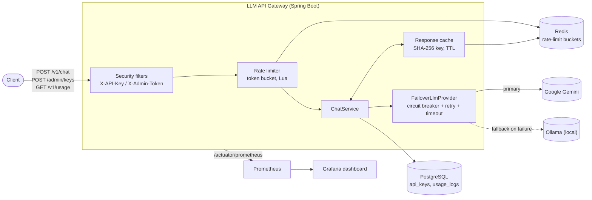

# LLM API Gateway

A Spring Boot service that sits between client apps and LLM providers: authenticates
API keys, rate-limits and caches requests, forwards to Google Gemini with automatic
failover to a local Ollama instance, and records usage and estimated cost — with a
Prometheus/Grafana stack for observability out of the box.

Built as a structured, phase-by-phase project to demonstrate backend and system
design skills for SDE/backend interviews: rate limiting, caching, fault tolerance,
observability, and testing, each with the design trade-offs made explicit.

## Features

- **Chat proxy** (`POST /v1/chat`) — forwards a prompt to Gemini, returns the
  generated text
- **API-key auth** — SHA-256-hashed keys, `FREE`/`PRO` tiers, never stored or logged
  in raw form
- **Admin auth** — a separate shared-secret scheme (`X-Admin-Token`) for key creation,
  constant-time compared, fails closed if unset
- **Distributed rate limiting** — token bucket per API key, atomic via a Lua script
  in Redis, correct across multiple gateway instances
- **Response caching** — SHA-256 cache key, Redis with TTL, `cached: true` on a hit
- **Usage metering** (`GET /v1/usage`) — requests, tokens, estimated cost, cache hits,
  written asynchronously so logging never adds latency to the response
- **Failover and resilience** — Resilience4j circuit breaker + retry + timeout around
  Gemini, falling back to a local Ollama instance on failure
- **Observability** — Actuator health, custom Micrometer metrics, structured JSON
  logs with a per-request ID, Prometheus + a provisioned Grafana dashboard
- **One-command setup** — the whole stack, app included, via `docker compose up`

## Architecture



Package layout mirrors this: `controller / service / provider / repository / entity /
security / ratelimit / cache / logging / metrics / util / config / dto / exception`.

## Quick start

```bash
git clone https://github.com/preeti20-27/llm-api-gateway.git
cd llm-api-gateway
cp .env.example .env
# edit .env — at minimum set GEMINI_API_KEY and ADMIN_TOKEN (e.g. `openssl rand -hex 32`)

docker compose up -d --build
```

That's the whole setup: the app, Postgres, Redis, Prometheus, and Grafana. Give it a
few seconds to start, then:

```bash
# 1. Create a key (returns the raw key once) — requires the admin token
curl -X POST http://localhost:8080/admin/keys \
  -H "Content-Type: application/json" \
  -H "X-Admin-Token: <your ADMIN_TOKEN>" \
  -d '{"name": "my-test-app", "tier": "FREE"}'

# 2. Use it
curl -X POST http://localhost:8080/v1/chat \
  -H "Content-Type: application/json" \
  -H "X-API-Key: <the key from step 1>" \
  -d '{"prompt": "Say hello in one sentence."}'

# 3. Run it again — the second call has "cached": true
# 4. Check usage
curl http://localhost:8080/v1/usage -H "X-API-Key: <the key from step 1>"
```

Grafana: [http://localhost:3000](http://localhost:3000) (anonymous viewer access is
on — no login needed) has the "LLM API Gateway" dashboard already provisioned.
Prometheus: [http://localhost:9090](http://localhost:9090). Raw endpoints:
[/actuator/health](http://localhost:8080/actuator/health),
[/actuator/prometheus](http://localhost:8080/actuator/prometheus).

Ollama fallback is optional — the app runs fine without it; a Gemini failure with no
Ollama installed just surfaces as a `502` instead of failing over. To enable it,
install [Ollama](https://ollama.com), run `ollama pull llama3.2`, and set
`OLLAMA_BASE_URL` in `.env` if it's not on the default port.

### For active development

Running the app in a container is great for "just run it," but not for hot-reload or
IDE debugging. For that, run just the infrastructure via Compose and the app on the
host instead:

```bash
docker compose up -d postgres redis prometheus grafana
./mvnw spring-boot:run   # or .\mvnw.cmd spring-boot:run on Windows
```

Prometheus's scrape config covers both cases (containerized or host-run) so metrics
work either way — see `monitoring/prometheus/prometheus.yml`.

## API reference

| Endpoint | Auth | Description |
|---|---|---|
| `POST /v1/chat` | `X-API-Key` | Generate a chat completion |
| `GET /v1/usage` | `X-API-Key` | Usage totals for the calling key |
| `POST /admin/keys` | `X-Admin-Token` | Create an API key |
| `GET /actuator/health` | none | Liveness/readiness, DB/Redis/circuit-breaker status |
| `GET /actuator/prometheus` | none | Metrics in Prometheus exposition format |

**`POST /v1/chat`**
```bash
curl -X POST http://localhost:8080/v1/chat \
  -H "Content-Type: application/json" \
  -H "X-API-Key: sk-..." \
  -d '{"prompt": "Explain the CAP theorem in two sentences.", "maxTokens": 200}'
```
```json
{
  "response": "...",
  "provider": "gemini",
  "cached": false,
  "tokensUsed": 47,
  "latencyMs": 812
}
```
`model` and `maxTokens` are optional. Rate-limited requests return `429` with
`Retry-After` and `X-RateLimit-Remaining` headers; every response (allowed or not)
carries `X-RateLimit-Remaining`.

**`GET /v1/usage`**
```bash
curl http://localhost:8080/v1/usage -H "X-API-Key: sk-..."
```
```json
{ "totalRequests": 42, "totalTokens": 1930, "estimatedCostUsd": 0.00048, "cacheHits": 11 }
```

**`POST /admin/keys`**
```bash
curl -X POST http://localhost:8080/admin/keys \
  -H "Content-Type: application/json" \
  -H "X-Admin-Token: ..." \
  -d '{"name": "my-app", "tier": "PRO"}'
```
```json
{ "id": "...", "name": "my-app", "tier": "PRO", "apiKey": "sk-...", "createdAt": "..." }
```
`apiKey` is shown **once** — only its SHA-256 hash is ever stored. `tier` is `FREE`
or `PRO`.

Every error response — auth failure, validation, rate limit, provider failure — uses
the same JSON shape:
```json
{ "timestamp": "...", "status": 401, "error": "Unauthorized", "message": "...", "path": "/v1/chat" }
```

## Configuration

Copy `.env.example` to `.env` and fill in real values; see that file for the full,
commented list. The essentials:

| Variable | Required | Purpose |
|---|---|---|
| `GEMINI_API_KEY` | yes | Google Gemini API key ([free tier](https://aistudio.google.com/app/apikey)) |
| `ADMIN_TOKEN` | yes | Shared secret for `POST /admin/keys` — unset means every admin request is rejected |
| `DB_URL` / `DB_USERNAME` / `DB_PASSWORD` | has defaults | Postgres connection |
| `REDIS_HOST` / `REDIS_PORT` | has defaults | Redis connection |
| `OLLAMA_BASE_URL` / `OLLAMA_MODEL` | optional | Fallback provider |

Operational tuning (rate limits, cache TTL, circuit breaker thresholds, pricing) is
plain YAML in `application.yml`, not env-driven — see the Design decisions section
for why.

## Design decisions

**Token bucket over sliding/fixed window** for rate limiting. Fixed window has a
boundary problem (burst at the edge of two windows effectively doubles the limit);
sliding window log is accurate but needs to store every request timestamp. Token
bucket needs only two numbers per key (tokens, last-refill time), allows small
bursts up to capacity, and gives smooth throughput.

**A Lua script, not `MULTI`/`WATCH`**, for the atomic check-and-decrement. Two
concurrent requests both reading "1 token left" and both deciding to allow
themselves is a classic TOCTOU race; a Lua script runs as one atomic step on the
Redis server itself, with no separate round trips or retry logic needed. See
`token_bucket.lua`'s own comments for the algorithm, including a subtle
floating-point bug (epoch seconds vs. milliseconds) that surfaced and got fixed
during testing.

**The cache is shared across every caller**, not scoped per API key — the cache key
is `SHA-256(model + normalized prompt + maxTokens)`, deliberately excluding the
caller's identity. Cheaper and faster (one Gemini call serves every customer with
the same prompt), at the cost of one caller's prompt being able to warm another's
cache hit. Right call for a stateless "prompt in, completion out" endpoint; would be
wrong if prompts ever carried private, caller-specific context.

**TTL expiry, not explicit invalidation**, for cache staleness. There's no signal
that "this LLM answer is now wrong" the way there would be for, say, a cached
account balance — the model doesn't change mid-TTL — so a short, generous TTL
(`cache.ttl-seconds`) is simpler and correct here.

**Async usage logging.** The response returned to the client is fully built *before*
the usage-log write is even triggered (`@Async`, backed by a virtual-thread
executor, consistent with `spring.threads.virtual.enabled` for request handling
itself) — a slow or failed log write can never affect the answer the client sees.
The trade-off is eventual consistency: `GET /v1/usage` could be queried a few
milliseconds before the very latest request's log row lands.

**Circuit breaker + retry + timeout, with a shared fallback.** Whichever of the
three trips first — Gemini's failure rate crossing the threshold, transient errors
exhausting retries, or a slow response timing out — the caller gets an answer from
Ollama instead of an error. Tuning: `minimum-number-of-calls` avoids tripping the
breaker on a statistically meaningless sample (2 failures out of 2 calls looks
alarming but means nothing); `failure-rate-threshold` is the real sensitivity dial.

**Two Spring Security filter chains**, not one, scoped by `securityMatcher`:
`/admin/**` uses a shared secret, `/v1/**` uses per-caller API keys — the documented
pattern for "different auth mechanism per area of the app," rather than one chain
with conditional logic threaded through it.

**Custom security/resilience filters are constructed by hand in `SecurityConfig`,
not `@Component`-annotated.** A `@Component` implementing `Filter` gets
auto-registered by Spring Boot as a *generic* servlet filter, independent of Spring
Security's own chain — meaning it could run twice per request. Constructing it
directly and wiring it via `addFilterBefore`/`addFilterAfter` is the pattern
Spring Security's own docs use for custom filters.

**A percentile histogram for latency, not a single client-computed percentile.**
`Timer.builder(...).publishPercentileHistogram()` publishes real bucket data so
Grafana computes p95/p99 server-side via `histogram_quantile()` — a single
client-side percentile can't be meaningfully aggregated across multiple gateway
instances.

**Structured JSON logs with MDC**, not a request ID formatted into each message by
hand. Every logger everywhere — including framework logs you don't control — picks
up `requestId` automatically once it's in MDC, with zero per-call-site wiring, and
JSON output makes every field genuinely queryable instead of needing regex parsing.

**Deliberate, documented scope simplifications** (not oversights): Actuator is fully
open (fine for local dev and this project's scope; production would put it on a
separate internal-only management port); estimated cost uses one blended
$/1k-tokens rate per provider (real per-token pricing needs a prompt/completion
split `LlmProviderResponse` doesn't carry). Both are called out at their point of
implementation, not left silent.

## Testing

```bash
./mvnw test   # or .\mvnw.cmd test on Windows
```

55 tests across unit, slice, and full-stack integration levels. **No provider calls
ever hit a real API in tests** — `GeminiProviderTest` uses `@RestClientTest` with a
`MockRestServiceServer`, and every higher-level test mocks `LlmProvider`/
`ChatService` — so CI needs no `GEMINI_API_KEY` or any other secret.

| Area | Representative tests |
|---|---|
| Auth (API key + admin token) | `ApiKeyAuthenticationIntegrationTest`, `AdminTokenAuthenticationIntegrationTest`, `AdminTokenAuthenticationFilterTest` |
| Rate limiting | `RateLimiterTest` (Lua script directly, real Redis), `RateLimitIntegrationTest` (full HTTP path) |
| Caching | `ResponseCacheTest`, `CacheKeyGeneratorTest`, `UsageAndCacheIntegrationTest` |
| Failover | `FailoverLlmProviderTest` — simulates Gemini failing, verifies fallback to Ollama |
| Observability | `GatewayMetricsTest`, `RequestIdFilterTest`, `ActuatorIntegrationTest` |

Integration tests spin up real Postgres and Redis via Testcontainers — Docker must
be running, but no manual setup is needed.

**Windows + Docker Desktop:** if tests fail with `Could not find a valid Docker
environment`, Testcontainers is likely probing the wrong named pipe. Find the right
one with `docker context inspect $(docker context show)` (look for the `Host`
field, typically `npipe:////./pipe/dockerDesktopLinuxEngine`) and export it before
running tests:
```powershell
$env:DOCKER_HOST = "npipe:////./pipe/dockerDesktopLinuxEngine"
```

## Load testing

`k6/chat-load-test.js` measures throughput and p95 latency under two conditions:
**cache cold** (a unique prompt every call, so every request misses and runs the
full auth → rate-limit → cache-check → provider-call → cache-write path) and
**cache warm** (the same prompt every call, so every request after the first hits
the cache and never reaches the provider).

```bash
# 1. Create a PRO-tier key (higher rate limit, so the limiter itself isn't the
#    bottleneck being measured) and note the raw key
curl -X POST http://localhost:8080/admin/keys \
  -H "Content-Type: application/json" -H "X-Admin-Token: <token>" \
  -d '{"name": "load-test", "tier": "PRO"}'

# 2. Run it (no local k6 install needed — uses the official Docker image)
docker run --rm -i --add-host=host.docker.internal:host-gateway \
  -e BASE_URL=http://host.docker.internal:8080 -e API_KEY=<key from step 1> \
  grafana/k6 run - < k6/chat-load-test.js
```

### Results

20 VUs per scenario, 30s each, run sequentially. Measured against the gateway with
Gemini's API call replaced by a local stub returning a canned response — this
isolates the *gateway's own* overhead (auth, rate limiting, cache logic, JSON
handling) from Gemini's real-world network latency, which the gateway has no
control over. 100% of the 16,197 checks passed; 0 request failures.

| Scenario | Throughput | avg | p90 | p95 | max |
|---|---|---|---|---|---|
| Cache cold (miss) | ~160 req/s | 124ms | 201ms | 261ms | 908ms |
| Cache warm (hit) | ~219 req/s | 91ms | 137ms | 165ms | 380ms |

The warm-cache path is both faster (no provider call, no cache write) and higher
throughput (~37% more) than cold — exactly the caching layer's purpose, and a good
sanity check that it's actually doing something measurable rather than just present.
Real Gemini latency (typically several hundred ms to a few seconds) sits on top of
the cold-cache numbers above in production; this test isolates what the gateway
itself contributes.

## Observability

- **Health**: `/actuator/health` includes Postgres/Redis connectivity and the
  Gemini circuit breaker's own state (`management.health.circuitbreakers.enabled`)
- **Metrics**: `/actuator/prometheus` — custom (`GatewayMetrics`: chat request count
  + latency histogram by provider, cache hit/miss, rate-limit rejections, provider
  fallback count) plus everything Spring Boot auto-instruments (JVM, HTTP, DB pool)
- **Logs**: JSON (`logstash-logback-encoder`), every line carries `requestId` via
  MDC (`RequestIdFilter`) — reused from an incoming `X-Request-Id` header when
  present, generated fresh otherwise, echoed back as a response header
- **Dashboard**: Grafana, provisioned automatically — 7 panels covering request
  rate, p95 latency by provider, cache hit rate, rate-limit rejections, fallback
  count, circuit breaker state, and JVM heap

## CI

`.github/workflows/ci.yml` runs `./mvnw test` on every push and PR to `main` —
GitHub's `ubuntu-latest` runners have Docker preinstalled, so Testcontainers works
with no extra setup. No secrets are configured or needed, for the same reason
described in Testing above. Surefire reports are uploaded as a build artifact on
every run, pass or fail.

## Project history

Built in seven phases, each with its own design write-up and interview-prep notes
in the commit history: project skeleton → API-key auth → distributed rate limiting
→ caching and usage metering → failover and resilience → observability → testing,
load test, CI, and this README.
